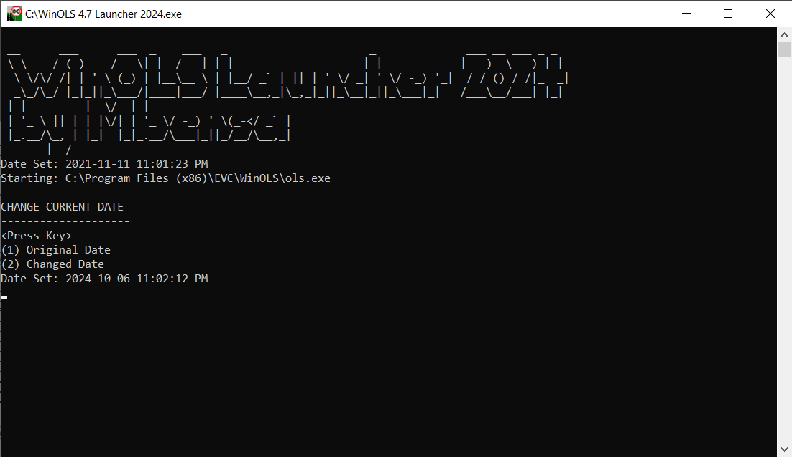

# winolslauncher2024
Application launcher with date changer

:: This is made only for learning purposes and is not intended to violate license terms of software.

:: For that reason the code uploaded here will not work specific testing environment it was created for.

## Usage
* Run launcher. This will automatically change the computer date and run the testing software.
* Come back to launcher and change the date to current date so saved files and other stuff have current date.
* After closing the testing software the date will automatically revert back to original current date if it was not changed manually before and close the launcher.

